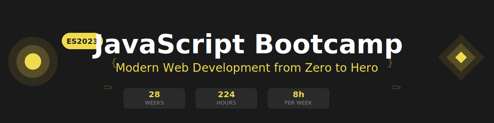

<p align="center">
  
</p>

<p align="center">
  <a href="https://github.com/ergrato-dev/bc-javascript-es2023/blob/main/LICENSE"></a>
  <a href="#"></a>
  <a href="#"></a>
  <a href="#"></a>
  <a href="CONTRIBUTING.md"></a>
</p>

<p align="center">
  <a href="README_EN.md"></a>
</p>

---

## 📋 Descripción

Bootcamp intensivo de **34 semanas (~8.5 meses)** enfocado en el dominio de JavaScript moderno (ES2023). Diseñado para llevar a estudiantes de cero a desarrollador JavaScript Junior, con énfasis en código limpio, mejores prácticas y proyectos del mundo real.

> 🏛️ **Política de Dominios Únicos (Anticopia)**: Cada aprendiz trabaja sobre un dominio de negocio único asignado por el instructor (Biblioteca, Farmacia, Gimnasio, etc.). Esto garantiza implementaciones originales y previene la copia entre compañeros.

### 🎯 Objetivos

Al finalizar el bootcamp, los estudiantes serán capaces de:

- ✅ Dominar las características modernas de JavaScript (ES2023)
- ✅ Trabajar con programación asincrónica (Promises, async/await)
- ✅ Manipular el DOM y gestionar eventos de manera efectiva
- ✅ Consumir y trabajar con APIs REST usando Fetch API
- ✅ Aplicar programación funcional y patrones modernos
- ✅ Escribir tests automatizados con Jest
- ✅ Implementar clean code y mejores prácticas
- ✅ Construir aplicaciones completas y complejas con JavaScript puro

### 🚀 ¿Por qué JavaScript Moderno?

> **JavaScript moderno desde el día 1** - Sin historia pre-ES2023, solo las mejores prácticas actuales.

Este bootcamp se enfoca exclusivamente en JavaScript ES2023 y características modernas. No perdemos tiempo en sintaxis antigua o patrones obsoletos. Los estudiantes aprenden directamente las herramientas y técnicas que usarán en el mundo profesional.

---

## 🗓️ Estructura del Bootcamp

|                   Etapa                   | Semanas | Horas | Temas Principales                                                                  |
| :---------------------------------------: | :-----: | :---: | ---------------------------------------------------------------------------------- |
| **Etapa 0** — Fundamentos de Programación |  1–10   |  80h  | console.log, tipos, variables, condicionales, bucles, funciones, arrays, objetos   |
|     **Etapa 1** — Fundamentos ES2023      |  11–22  |  96h  | Destructuring, clases, módulos ES, métodos modernos de array, Proxies, Generadores |
|    **Etapa 2** — Intermedio + Avanzado    |  23–34  |  96h  | Async/Await, Fetch API, DOM, Testing con Jest, Patrones de diseño, Clean Code      |

**Total: 34 semanas** | **~272 horas** de formación intensiva

---

## 📚 Contenido por Semana

Cada semana incluye:

```
bootcamp/week-XX/
├── README.md                 # Descripción y objetivos
├── rubrica-evaluacion.md     # Criterios de evaluación
├── 0-assets/                 # Imágenes y diagramas
├── 1-teoria/                 # Material teórico
├── 2-practicas/              # Ejercicios guiados
├── 3-proyecto/               # Proyecto semanal
├── 4-recursos/               # Recursos adicionales
│   ├── ebooks-free/
│   ├── videografia/
│   └── webgrafia/
└── 5-glosario/               # Términos clave
```

### 🔑 Componentes Clave

- 📖 **Teoría**: Conceptos fundamentales con ejemplos del mundo real
- 💻 **Práctica**: Ejercicios progresivos y proyectos hands-on
- 📝 **Evaluación**: Evidencias de conocimiento, desempeño y producto
- 🎓 **Recursos**: Glosarios, referencias y material complementario

---

## 🛠️ Stack Tecnológico

| Tecnología  | Versión | Uso                         |
| ----------- | ------- | --------------------------- |
| JavaScript  | ES2023  | Lenguaje principal          |
| Jest        | 29+     | Testing y TDD               |
| ESLint      | 8+      | Linting y calidad de código |
| Prettier    | 3+      | Formateo de código          |
| Live Server | -       | Desarrollo local            |
| Git         | 2.30+   | Control de versiones        |

**Gestores de paquetes**: `pnpm` o `yarn` (❌ NO usar npm)

---

## 🚀 Inicio Rápido

### Prerrequisitos

- **Node.js** 24 LTS (recomendado para herramientas de desarrollo)
- **Git** para control de versiones
- **VS Code** (recomendado) con extensiones incluidas
- Navegador moderno (Chrome, Firefox, Edge)

### 1. Clonar el Repositorio

```bash
git clone https://github.com/ergrato-dev/bc-javascript-es2023-cf.git
cd bc-javascript-es2023-cf
```

### 2. Instalar Extensiones de VS Code

```bash
# Abrir en VS Code
code .

# Las extensiones recomendadas aparecerán automáticamente
# O ejecutar: Ctrl+Shift+P → "Extensions: Show Recommended Extensions"
```

### 3. Navegar a la Semana Actual

```bash
cd bootcamp/week-01
```

### 4. Seguir las Instrucciones

Cada semana contiene un `README.md` con instrucciones detalladas.

---

## 📊 Metodología de Aprendizaje

### Estrategias Didácticas

- 🎯 **Aprendizaje Basado en Proyectos (ABP)**
- 🧩 **Práctica Deliberada**
- 🔄 **Coding Challenges**
- 👥 **Code Review entre pares**
- 🎮 **Live Coding**

### Distribución del Tiempo (8h/semana)

- **Teoría**: 2-2.5 horas
- **Prácticas**: 3-3.5 horas
- **Proyecto**: 2-2.5 horas

### Evaluación

Cada semana incluye tres tipos de evidencias:

1. **Conocimiento 🧠** (30%): Cuestionarios y evaluaciones teóricas
2. **Desempeño 💪** (40%): Ejercicios prácticos en clase
3. **Producto 📦** (30%): Entregables evaluables (proyectos funcionales)

**Criterio de aprobación**: Mínimo 70% en cada tipo de evidencia

---

## 🤝 Contribuir

¡Las contribuciones son bienvenidas! Este es un proyecto educativo de código abierto.

### Cómo Contribuir

1. Lee la [Guía de Contribución](CONTRIBUTING.md)
2. Revisa el [Código de Conducta](CODE_OF_CONDUCT.md)
3. Fork del repositorio
4. Crea tu rama (`git checkout -b feature/nueva-funcionalidad`)
5. Commit con [Conventional Commits](https://www.conventionalcommits.org/) (`git commit -m 'feat: add new exercise'`)
6. Push a la rama (`git push origin feature/nueva-funcionalidad`)
7. Abre un Pull Request

### 📋 Áreas de Contribución

- ✨ Ejercicios adicionales
- 📚 Mejoras en documentación
- 🐛 Corrección de errores
- 🎨 Recursos visuales (diagramas SVG)
- 🌐 Traducciones
- 📹 Videos tutoriales

---

## 📞 Soporte

- 📧 Email: [tu-email@ejemplo.com](mailto:tu-email@ejemplo.com)
- 💬 Discussions: [GitHub Discussions](https://github.com/ergrato-dev/bc-javascript-es2023-cf/discussions)
- 🐛 Issues: [GitHub Issues](https://github.com/ergrato-dev/bc-javascript-es2023-cf/issues)

---

## 📄 Licencia

Este proyecto está bajo la Licencia MIT - ver el archivo [LICENSE](LICENSE) para más detalles.

---

## 🏆 Agradecimientos

- [MDN Web Docs](https://developer.mozilla.org/) - Por la mejor documentación de JavaScript
- [JavaScript.info](https://javascript.info/) - Por tutoriales excelentes
- [TC39](https://tc39.es/) - Por evolucionar JavaScript
- Comunidad JavaScript - Por los recursos y ejemplos
- Todos los contribuidores

---

## 📚 Documentación Adicional

- [🤖 Instrucciones de Copilot](.github/copilot-instructions.md)
- [🤝 Guía de Contribución](CONTRIBUTING.md)
- [📜 Código de Conducta](CODE_OF_CONDUCT.md)
- [🔒 Política de Seguridad](SECURITY.md)

---

<p align="center">
  <strong>🎓 Bootcamp JavaScript Moderno (ES2023)</strong><br>
  <em>De cero a desarrollador JavaScript Junior en ~8.5 meses</em>
</p>

<p align="center">
  <a href="bootcamp/week-01">Comenzar Semana 1</a> •
  <a href="_docs">Ver Documentación</a> •
  <a href="https://github.com/ergrato-dev/bc-javascript-es2023-cf/issues">Reportar Issue</a> •
  <a href="CONTRIBUTING.md">Contribuir</a>
</p>

<p align="center">
  Hecho con ❤️ para la comunidad de desarrolladores
</p>
