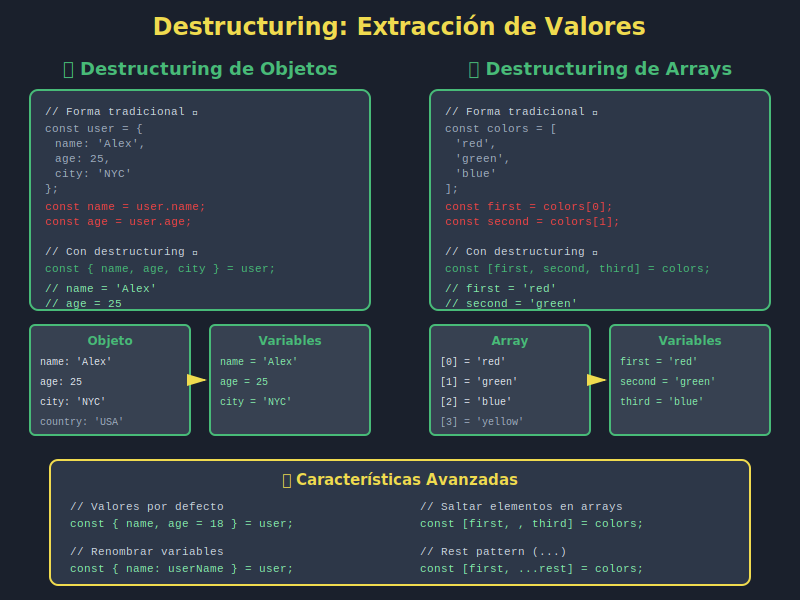

# 🎁 Destructuring Básico - Extraer Valores Fácilmente

## 🎯 Objetivos

- Comprender qué es destructuring
- Extraer valores de arrays con destructuring
- Extraer propiedades de objetos con destructuring
- Usar valores por defecto en destructuring
- Aplicar destructuring en parámetros de funciones
- Simplificar el código con esta característica

---

## 📖 Introducción



**Destructuring** (desestructuración) es una forma elegante de extraer valores de arrays y objetos, asignándolos a variables en una sola línea.

### El Problema Antiguo

```javascript
// ❌ ANTES: Acceso manual tedioso
const user = {
  name: 'Ana',
  age: 25,
  email: 'ana@example.com'
};

const name = user.name;
const age = user.age;
const email = user.email;

const numbers = [1, 2, 3, 4, 5];
const first = numbers[0];
const second = numbers[1];
const third = numbers[2];
```

### La Solución Moderna

```javascript
// ✅ AHORA: Destructuring elegante
const user = {
  name: 'Ana',
  age: 25,
  email: 'ana@example.com'
};

const { name, age, email } = user;

const numbers = [1, 2, 3, 4, 5];
const [first, second, third] = numbers;
```

---

## 📦 Destructuring de Objetos

### Sintaxis Básica

```javascript
const { property1, property2 } = object;
```

### Ejemplos Básicos

```javascript
const user = {
  name: 'Carlos',
  age: 30,
  city: 'Madrid'
};

// ✅ Extraer propiedades
const { name, age, city } = user;

console.log(name);  // 'Carlos'
console.log(age);   // 30
console.log(city);  // 'Madrid'
```

### Renombrar Variables

```javascript
const user = {
  name: 'Ana',
  age: 25
};

// ✅ Renombrar durante destructuring
const { name: userName, age: userAge } = user;

console.log(userName);  // 'Ana'
console.log(userAge);   // 25
// console.log(name);   // ReferenceError: name is not defined
```

### Valores por Defecto

```javascript
const user = {
  name: 'Luis'
  // age no está definido
};

// ✅ Valor por defecto si la propiedad no existe
const { name, age = 18 } = user;

console.log(name);  // 'Luis'
console.log(age);   // 18 (valor por defecto)
```

### Combinar Renombrado y Valores por Defecto

```javascript
const user = {
  name: 'María'
};

// ✅ Renombrar Y asignar valor por defecto
const { name: userName, age: userAge = 20 } = user;

console.log(userName);  // 'María'
console.log(userAge);   // 20
```

### Destructuring Anidado

```javascript
const user = {
  name: 'Ana',
  address: {
    city: 'Madrid',
    zipCode: '28001',
    country: 'Spain'
  }
};

// ✅ Extraer propiedades anidadas
const {
  name,
  address: { city, zipCode }
} = user;

console.log(name);     // 'Ana'
console.log(city);     // 'Madrid'
console.log(zipCode);  // '28001'
// console.log(address); // ReferenceError (no se extrajo address, solo sus propiedades)
```

### Extraer y Mantener el Objeto

```javascript
const user = {
  name: 'Carlos',
  address: {
    city: 'Barcelona',
    country: 'Spain'
  }
};

// ✅ Extraer tanto el objeto como sus propiedades
const {
  name,
  address,
  address: { city }
} = user;

console.log(name);     // 'Carlos'
console.log(address);  // { city: 'Barcelona', country: 'Spain' }
console.log(city);     // 'Barcelona'
```

---

## 📋 Destructuring de Arrays

### Sintaxis Básica

```javascript
const [item1, item2, item3] = array;
```

### Ejemplos Básicos

```javascript
const colors = ['red', 'green', 'blue', 'yellow'];

// ✅ Extraer elementos por posición
const [first, second, third] = colors;

console.log(first);   // 'red'
console.log(second);  // 'green'
console.log(third);   // 'blue'
```

### Saltar Elementos

```javascript
const numbers = [1, 2, 3, 4, 5];

// ✅ Saltar elementos con comas
const [first, , third, , fifth] = numbers;

console.log(first);  // 1
console.log(third);  // 3
console.log(fifth);  // 5
```

### Valores por Defecto

```javascript
const colors = ['red'];

// ✅ Valores por defecto para elementos que no existen
const [primary, secondary = 'blue', tertiary = 'green'] = colors;

console.log(primary);    // 'red'
console.log(secondary);  // 'blue' (valor por defecto)
console.log(tertiary);   // 'green' (valor por defecto)
```

### Rest Pattern (Resto de Elementos)

```javascript
const numbers = [1, 2, 3, 4, 5];

// ✅ Extraer primeros elementos y capturar el resto
const [first, second, ...rest] = numbers;

console.log(first);   // 1
console.log(second);  // 2
console.log(rest);    // [3, 4, 5]
```

### Intercambiar Variables

```javascript
let a = 1;
let b = 2;

// ✅ Intercambiar valores sin variable temporal
[a, b] = [b, a];

console.log(a);  // 2
console.log(b);  // 1
```

---

## 🔧 Destructuring en Parámetros de Funciones

### Objetos como Parámetros

```javascript
// ❌ ANTES: Acceder a propiedades dentro de la función
function greetUser(user) {
  const name = user.name;
  const age = user.age;
  return `Hello ${name}, you are ${age} years old`;
}

// ✅ AHORA: Destructuring en parámetros
const greetUser = ({ name, age }) => {
  return `Hello ${name}, you are ${age} years old`;
};

// Uso
const user = { name: 'Ana', age: 25 };
console.log(greetUser(user));
// "Hello Ana, you are 25 years old"
```

### Con Valores por Defecto

```javascript
// ✅ Valores por defecto en parámetros
const createUser = ({ name, age = 18, role = 'user' }) => {
  return { name, age, role };
};

console.log(createUser({ name: 'Carlos' }));
// { name: 'Carlos', age: 18, role: 'user' }

console.log(createUser({ name: 'Ana', age: 25, role: 'admin' }));
// { name: 'Ana', age: 25, role: 'admin' }
```

### Arrays como Parámetros

```javascript
// ✅ Destructuring de arrays en parámetros
const getFirstTwo = ([first, second]) => {
  return { first, second };
};

const numbers = [10, 20, 30, 40];
console.log(getFirstTwo(numbers));
// { first: 10, second: 20 }
```

---

## 💡 Casos de Uso Comunes

### 1. Extraer Datos de APIs

```javascript
// ✅ Response de API
const response = {
  data: {
    user: {
      id: 123,
      name: 'Ana García',
      email: 'ana@example.com'
    }
  },
  status: 200
};

const {
  data: { user: { name, email } },
  status
} = response;

console.log(name);    // 'Ana García'
console.log(email);   // 'ana@example.com'
console.log(status);  // 200
```

### 2. Configuración de Funciones

```javascript
// ✅ Opciones con valores por defecto
const fetchData = ({
  url,
  method = 'GET',
  headers = {},
  timeout = 5000
}) => {
  console.log(`${method} ${url}`);
  console.log(`Timeout: ${timeout}ms`);
};

fetchData({ url: '/api/users' });
// GET /api/users
// Timeout: 5000ms

fetchData({
  url: '/api/users',
  method: 'POST',
  timeout: 3000
});
// POST /api/users
// Timeout: 3000ms
```

### 3. Retornar Múltiples Valores

```javascript
// ✅ Retornar objeto y destructurar
const calculateStats = numbers => {
  const sum = numbers.reduce((a, b) => a + b, 0);
  const avg = sum / numbers.length;
  const max = Math.max(...numbers);
  const min = Math.min(...numbers);

  return { sum, avg, max, min };
};

const numbers = [10, 20, 30, 40, 50];
const { sum, avg, max, min } = calculateStats(numbers);

console.log(`Sum: ${sum}, Average: ${avg}, Max: ${max}, Min: ${min}`);
// Sum: 150, Average: 30, Max: 50, Min: 10
```

### 4. Extraer de Arrays de Objetos

```javascript
const users = [
  { name: 'Ana', age: 25, city: 'Madrid' },
  { name: 'Carlos', age: 30, city: 'Barcelona' },
  { name: 'Luis', age: 28, city: 'Valencia' }
];

// ✅ Destructuring en map
const names = users.map(({ name }) => name);
console.log(names);
// ['Ana', 'Carlos', 'Luis']

// ✅ Destructuring en filter
const adults = users.filter(({ age }) => age >= 25);
console.log(adults);
// [{ name: 'Ana', age: 25, ... }, { name: 'Carlos', age: 30, ... }, ...]
```

### 5. React Components (Adelanto)

```javascript
// ✅ Muy común en React para props
const UserCard = ({ name, email, avatar, isActive = true }) => {
  return `
    <div class="user-card">
      
      <h3>${name}</h3>
      <p>${email}</p>
      <span class="badge">${isActive ? 'Active' : 'Inactive'}</span>
    </div>
  `;
};
```

### 6. Import de Módulos

```javascript
// ✅ Destructuring en imports (ES2023 modules)
import { useState, useEffect } from 'react';
import { formatDate, capitalize } from './utils';

// En lugar de:
import React from 'react';
const useState = React.useState;
const useEffect = React.useEffect;
```

---

## 🎨 Combinando Destructuring con Otras Características

### Con Spread Operator

```javascript
const user = {
  id: 1,
  name: 'Ana',
  email: 'ana@example.com',
  role: 'admin',
  active: true
};

// ✅ Extraer algunas propiedades, capturar el resto
const { id, name, ...otherProps } = user;

console.log(id);          // 1
console.log(name);        // 'Ana'
console.log(otherProps);  // { email: '...', role: 'admin', active: true }
```

### Con Template Literals

```javascript
const user = {
  firstName: 'Ana',
  lastName: 'García',
  age: 25
};

// ✅ Destructuring + template literals
const { firstName, lastName, age } = user;
const message = `${firstName} ${lastName} is ${age} years old`;

// O directamente en parámetro de función
const formatUser = ({ firstName, lastName, age }) =>
  `${firstName} ${lastName} is ${age} years old`;

console.log(formatUser(user));
// "Ana García is 25 years old"
```

### Con Arrow Functions

```javascript
// ✅ Todo junto: arrow function + destructuring + template literals
const createGreeting = ({ name, timeOfDay = 'day' }) =>
  `Good ${timeOfDay}, ${name}!`;

console.log(createGreeting({ name: 'Carlos' }));
// "Good day, Carlos!"

console.log(createGreeting({ name: 'Ana', timeOfDay: 'morning' }));
// "Good morning, Ana!"
```

---

## ⚠️ Errores Comunes

### Error 1: Intentar Destructurar `null` o `undefined`

```javascript
// ❌ ERROR
const data = null;
const { name } = data;  // TypeError: Cannot destructure property 'name' of 'null'

// ✅ SOLUCIÓN: Valor por defecto o verificación
const { name } = data || {};

// ✅ O con optional chaining (ES2020)
const { name } = data ?? {};
```

### Error 2: Olvidar las Llaves en Objetos

```javascript
// ❌ ERROR: Sintaxis de array en objeto
const user = { name: 'Ana', age: 25 };
const [name, age] = user;  // undefined, undefined

// ✅ CORRECTO: Llaves para objetos
const { name, age } = user;
```

### Error 3: Usar el Mismo Nombre Dos Veces

```javascript
const user = { name: 'Ana', age: 25 };
const product = { name: 'Laptop', price: 999 };

// ❌ ERROR: name ya está declarado
const { name } = user;
const { name } = product;  // SyntaxError: Identifier 'name' has already been declared

// ✅ SOLUCIÓN: Renombrar
const { name: userName } = user;
const { name: productName } = product;
```

### Error 4: Destructuring Profundo sin Verificación

```javascript
const user = {
  name: 'Ana'
  // address no existe
};

// ❌ ERROR: address es undefined
const { address: { city } } = user;  // TypeError

// ✅ SOLUCIÓN: Valor por defecto
const { address: { city } = {} } = user;
// O mejor:
const { address = {} } = user;
const { city } = address;
```

---

## 🧪 Ejercicios Prácticos

### Ejercicio 1: Objetos Básicos

```javascript
const person = {
  firstName: 'Juan',
  lastName: 'Pérez',
  age: 30,
  country: 'Spain'
};

// Extrae firstName, lastName y country usando destructuring
// Tu código aquí
```

<details>
<summary>Ver solución</summary>

```javascript
const { firstName, lastName, country } = person;

console.log(firstName);  // 'Juan'
console.log(lastName);   // 'Pérez'
console.log(country);    // 'Spain'
```

</details>

### Ejercicio 2: Arrays con Saltos

```javascript
const numbers = [10, 20, 30, 40, 50];

// Extrae el primer, tercer y quinto número
// Tu código aquí
```

<details>
<summary>Ver solución</summary>

```javascript
const [first, , third, , fifth] = numbers;

console.log(first);  // 10
console.log(third);  // 30
console.log(fifth);  // 50
```

</details>

### Ejercicio 3: Función con Destructuring

```javascript
// Crea una función que reciba un objeto de producto
// y retorne un string formateado
// Ejemplo: { name: 'Laptop', price: 999, brand: 'Dell' }
// Retorna: "Dell Laptop - €999"

const formatProduct = /* tu código aquí */ => {
  // ...
};
```

<details>
<summary>Ver solución</summary>

```javascript
const formatProduct = ({ name, price, brand }) =>
  `${brand} ${name} - €${price}`;

// Uso
const product = { name: 'Laptop', price: 999, brand: 'Dell' };
console.log(formatProduct(product));
// "Dell Laptop - €999"
```

</details>

### Ejercicio 4: Swap Variables

```javascript
let x = 5;
let y = 10;

// Intercambia los valores de x e y usando destructuring
// Tu código aquí

console.log(x);  // Debería ser 10
console.log(y);  // Debería ser 5
```

<details>
<summary>Ver solución</summary>

```javascript
let x = 5;
let y = 10;

[x, y] = [y, x];

console.log(x);  // 10
console.log(y);  // 5
```

</details>

---

## 🎓 Conceptos Clave

| Término                  | Definición                                       |
| ------------------------ | ------------------------------------------------ |
| **Destructuring**        | Extraer valores de arrays/objetos a variables    |
| **Pattern Matching**     | Coincidencia de patrones para extracción         |
| **Default Values**       | Valores asignados si la propiedad no existe      |
| **Rest Pattern**         | Capturar elementos restantes con `...`           |
| **Nested Destructuring** | Destructuring de estructuras anidadas            |
| **Renaming**             | Cambiar nombre de variable durante destructuring |

---

## 📊 Tabla Comparativa: Sintaxis

| Tipo          | Sintaxis                           | Ejemplo                                      |
| ------------- | ---------------------------------- | -------------------------------------------- |
| **Objeto**    | `const { prop } = obj`             | `const { name } = user`                      |
| **Array**     | `const [item] = arr`               | `const [first] = numbers`                    |
| **Renombrar** | `const { old: new } = obj`         | `const { name: userName } = user`            |
| **Default**   | `const { prop = val } = obj`       | `const { age = 18 } = user`                  |
| **Rest**      | `const { a, ...rest } = obj`       | `const { id, ...data } = user`               |
| **Anidado**   | `const { a: { b } } = obj`         | `const { address: { city } } = user`         |
| **Parámetro** | `const func = ({ prop }) => {...}` | `const greet = ({ name }) => \`Hi ${name}\`` |

---

## ✅ Checklist de Verificación

Antes de continuar, asegúrate de:

- [ ] Entender la sintaxis básica de destructuring
- [ ] Poder destructurar objetos y arrays
- [ ] Saber renombrar variables durante destructuring
- [ ] Aplicar valores por defecto
- [ ] Usar destructuring en parámetros de funciones
- [ ] Combinar destructuring con rest pattern
- [ ] Entender destructuring anidado

---

## 🔗 Recursos Adicionales

- [MDN: Destructuring Assignment](https://developer.mozilla.org/es/docs/Web/JavaScript/Reference/Operators/Destructuring_assignment)
- [JavaScript.info: Destructuring](https://javascript.info/destructuring-assignment)

---

## 🎉 ¡Teoría Completa!

Felicitaciones, has completado toda la teoría de la Semana 1:

1. ✅ Introducción a ES2023
2. ✅ let y const
3. ✅ Template Literals
4. ✅ Arrow Functions
5. ✅ Destructuring Básico

---

## 🚀 Próximo Paso

Ahora es momento de poner en práctica todo lo aprendido con ejercicios hands-on.

➡️ **Siguiente**: [Ejercicios Prácticos](../2-practicas/)

---

<p align="center">
  <strong>🎁 Destructuring Dominado</strong><br>
  <em>Extrae datos como un profesional</em>
</p>
